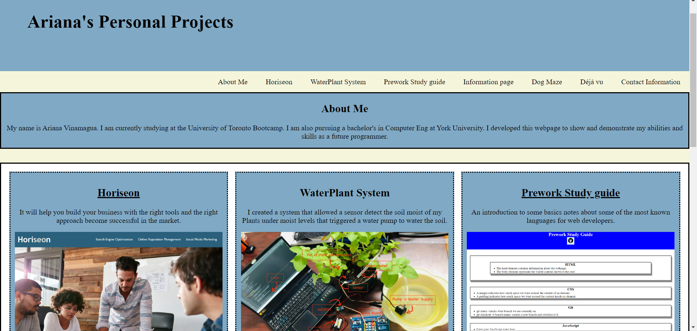

# My-Personal-Portafolio-Work

## Description
I am introducing my personal portafolio. Among the skills I learned, I was able to put them into practice and create a display of each 
individual project, along with some links to their websites, or images of how the prototype looks like. 

[Go to Website here](https://ari07-ari.github.io/Module-1-Challange-Code/)

## Installation
I created a new repository in GitHub and then cloned it to my computer. The using the skills learned at the Bootcamp, I was able to
arrange a website to display my projects.

## Usage
It provides information about useful website/apps/tools which can be used in our everyday life.

## Credits
The University of Toronto
Ariana Vinamagua